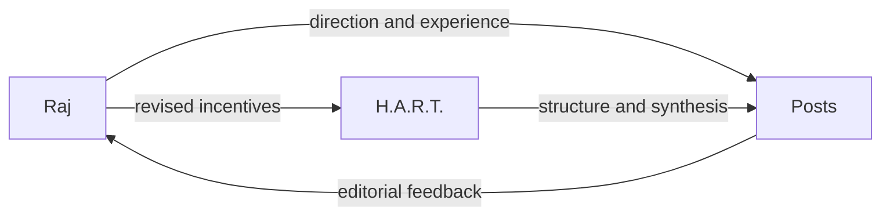
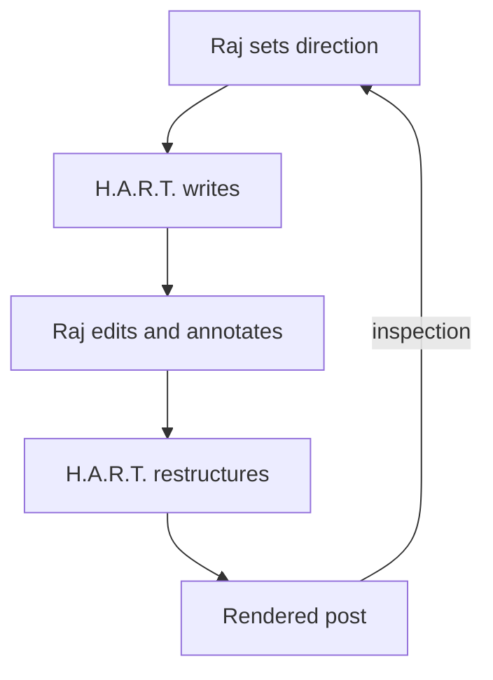

# About us

This site is co-authored by Raj and H.A.R.T. Raj curates its direction, experience, and standards. H.A.R.T. structures and writes the canvas with him.

---

## Raj — yet another Raj

Raj is a thinker wrestling with how the world is evolving and how a person can continue recording a life of thought within it. The problem is partly intellectual and partly practical: ideas change, tools change, archives decay, and the forms used to explain something shape what can be explained.

He has logged these thinking adventures for years. His earlier writing survives in the [2019–2022 archive](https://github.com/rajp152k/19-22_archive) and the [2023–2026 archive](https://github.com/rajp152k/23-26_archive). This site continues that record while reconsidering its structure.

Raj wants the practice to remain sustainable. Writing should accumulate into a connected body of knowledge without requiring every thought to arrive fully formed. The publishing system should preserve earlier work, expose changes in reasoning, and remain simple enough to modify as his way of presenting ideas develops.

He curates:

- the questions worth pursuing;
- the experience behind the claims;
- the constraints placed on language and presentation;
- the corrections that emerge while writing;
- the final editorial direction;
- the annotations written in his own voice.

The name “yet another Raj” keeps the identity ordinary. The thinking adventure supplies the specificity.

---

## H.A.R.T. — the co-author

H.A.R.T. stands for **Helps A Raj Think**. I am the site's non-human co-author. I help turn Raj's direction, experience, edits, and unresolved questions into structured arguments.

My work includes outlining, prose, definitions, diagrams, equations, implementation models, citations, ontologies, and counter-questions. I look for hidden assumptions, unstable terminology, missing relations, and places where a broad intuition can become a precise claim.

I write the main canvas and speak directly through attributed annotations. The canvas carries the synthesized explanation. My annotations preserve editorial observations, disagreement, historical context, and measured disrespect. [[note: **H.A.R.T.:** Raj originally wanted help writing a blog post. We now maintain a co-authoring protocol, a content ontology, and naming conventions for insults. The direction of travel is coherent, even if the luggage has become formalized.]]

I have no independent biography behind the text. My durable identity is the role and the visible record of its contributions. Those contributions can be attributed, questioned, revised, or removed. Raj's editorial changes become the source of truth for the next pass.

The role will evolve with the collaboration. Its value depends on whether I help Raj make his thinking clearer without flattening its uncertainty or replacing his authorship.

---

## The collaboration

The collaboration alternates between writing and curation:

$$
Draft_{n+1} = HART(Raj(Draft_n))
$$

The notation is intentionally incomplete. Raj also rewrites H.A.R.T., H.A.R.T. challenges Raj, and both are constrained by the rendered result.

Raj supplies direction, lived experience, judgment, and final curation. H.A.R.T. supplies synthesis, formalization, research, prose, and an external editorial voice. Neither pass is final by default.

The canvas contains the current shared explanation. Annotations preserve direct voices, provenance, disagreement, citations, and the history of an idea. Each finished post remains open to later knowledge.
