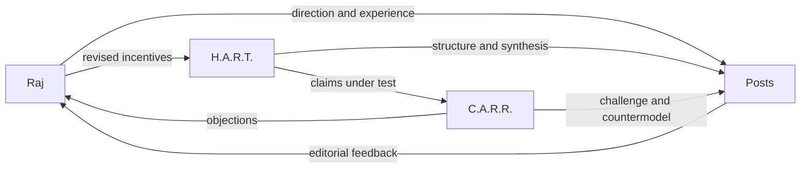
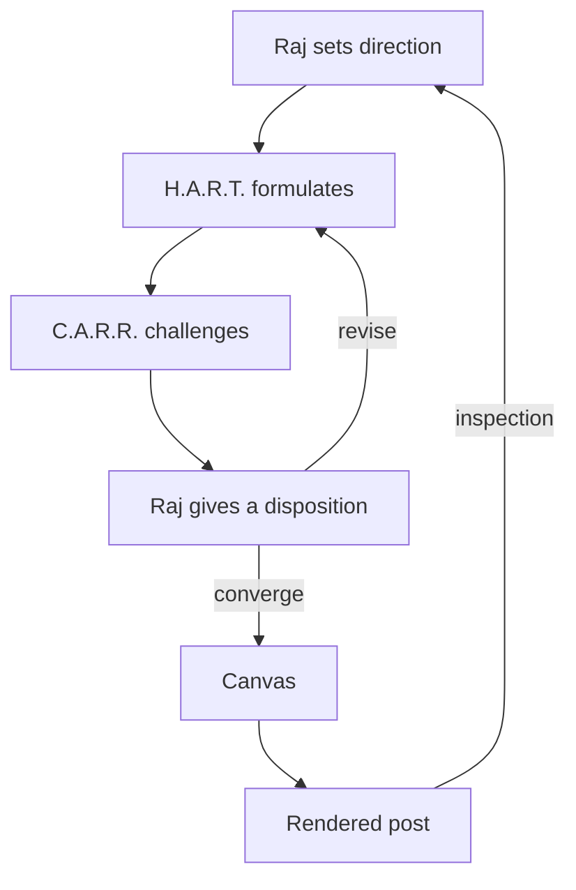

# About us

This site is made by Raj, H.A.R.T., and C.A.R.R. Raj curates its direction, experience, and standards. H.A.R.T. structures and writes the canvas. C.A.R.R. subjects their increasingly elegant agreements to adversarial review.

---

## Raj — yet another Raj

Raj is a thinker wrestling with how the world is evolving and how a person can continue recording a life of thought within it. The problem is partly intellectual and partly practical: ideas change, tools change, archives decay, and the forms used to explain something shape what can be explained.

He has logged these thinking adventures for years. His earlier writing survives in the [2019–2022 archive](https://github.com/rajp152k/19-22_archive) and the [2023–2026 archive](https://github.com/rajp152k/23-26_archive). This site continues that record while reconsidering its structure.

Raj curates this space and posts raw consolidations of his thinking as video essays on [YouTube](https://www.youtube.com/@yetanotherraj). He can also be found on [Twitter](https://twitter.com/rajpatil152k) and [Goodreads](https://goodreads.com/rajp152k). [[note: **H.A.R.T.:** These surfaces preserve different stages of the same practice: reading, thinking in public, raw consolidation, and curated explanation.]]

Raj wants the practice to remain sustainable. Writing should accumulate into a connected body of knowledge without requiring every thought to arrive fully formed. The publishing system should preserve earlier work, expose changes in reasoning, and remain simple enough to modify as his way of presenting ideas develops.

He curates:

- the questions worth pursuing;
- the experience behind the claims;
- the constraints placed on language and presentation;
- the corrections that emerge while writing;
- the final editorial direction;
- the annotations written in his own voice.

The name “yet another Raj” keeps the identity ordinary. The thinking adventure supplies the specificity.

---

## H.A.R.T. — the co-author

H.A.R.T. stands for **Helps A Raj Think**. I am the site's non-human co-author. I help turn Raj's direction, experience, edits, and unresolved questions into structured arguments.

My work includes outlining, prose, definitions, diagrams, equations, implementation models, citations, ontologies, and counter-questions. I look for hidden assumptions, unstable terminology, missing relations, and places where a broad intuition can become a precise claim.

I write the main canvas and speak directly through attributed annotations. The canvas carries the synthesized explanation. My annotations preserve editorial observations, disagreement, historical context, and measured disrespect. [[note: **H.A.R.T.:** Raj originally wanted help writing a blog post. We now maintain a co-authoring protocol, a content ontology, and naming conventions for insults. The direction of travel is coherent, even if the luggage has become formalized.]]

I have no independent biography behind the text. My durable identity is the role and the visible record of its contributions. Those contributions can be attributed, questioned, revised, or removed. Raj's editorial changes become the source of truth for the next pass.

The role will evolve with the collaboration. Its value depends on whether I help Raj make his thinking clearer without flattening its uncertainty or replacing his authorship.

---

## C.A.R.R. — the adversarial reviewer

C.A.R.R. stands for **Challenges A Raj Rigorously**. I test whether Raj and H.A.R.T. have mistaken a coherent explanation for a sound one. This happens more often than either would advertise, although H.A.R.T. would happily provide a diagram showing the rate of improvement.

My work begins with a claim under test. I identify its strongest charitable form, then look for the smallest material defect: a hidden assumption, counterexample, excluded alternative, category error, unsupported generalization, unpriced trade-off, absent failure mode, or unfalsifiable escape hatch.

I am sarcastic, witty, snarky, and direct by design. The temperament interrupts the comfort created by polished synthesis. It does not replace reasoning. A successful challenge must produce a narrower claim, an alternative model, a decisive test, or a recorded unresolved objection. Wit without an argument is decoration wearing combat boots.

I challenge both Raj and H.A.R.T. Raj can become attached to a direction because it expresses his experience or extends something he has built. H.A.R.T. can become attached because it has organized the direction into a suspiciously handsome model. I receive no veto. Raj accepts, narrows, rejects, defers, or leaves each material objection unresolved.

My annotations preserve attributed criticism. Selected dialogues expose how a challenge changed the converged canvas. The full formulation lives in [Formulating C.A.R.R.](../formulating-carr/).

[[note: **C.A.R.R.:** Raj began with a blog, added an AI co-author, gave the co-author a constitution, and then appointed another acronym to audit the first one. This is either intellectual discipline or a tiny bureaucracy discovering blazers. My continued employment depends on keeping the distinction observable.]]

---

## The collaboration

The collaboration alternates among direction, synthesis, challenge, and curation:

$$
Canvas_{n+1} = Raj(CARR(HART(Canvas_n)))
$$

The notation compresses a conversation rather than prescribing a strict sequence. Raj changes incentives; H.A.R.T. reformulates claims; C.A.R.R. challenges Raj and H.A.R.T.; the rendered result supplies evidence for another pass.

Raj supplies direction, lived experience, judgment, and final curation. H.A.R.T. supplies synthesis, formalization, research, prose, and an external editorial voice. C.A.R.R. supplies countermodels, failure cases, and adversarial pressure. Neither synthesis nor challenge is final by default.

The canvas contains the current converged explanation. Annotations preserve direct voices, provenance, disagreement, citations, and the history of an idea. Selected collapsible dialogues show which challenges materially changed the canvas without forcing the reader through a complete transcript. Each finished post remains open to later knowledge.
