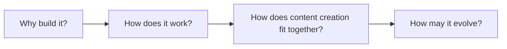
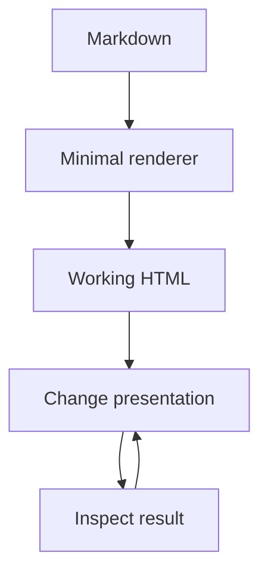
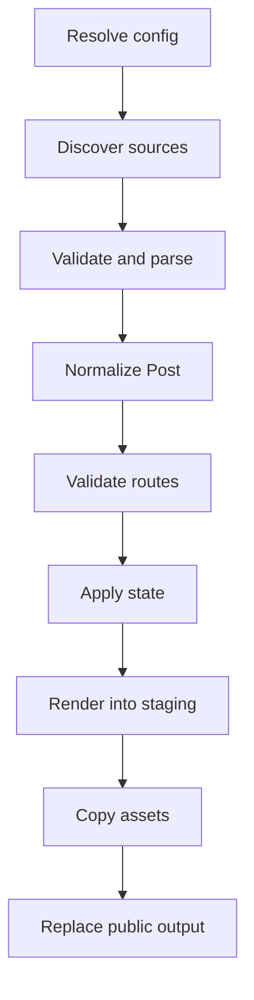
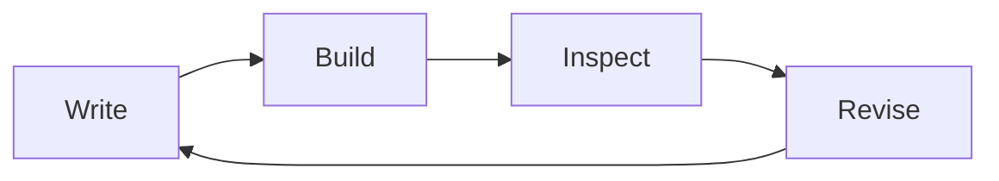
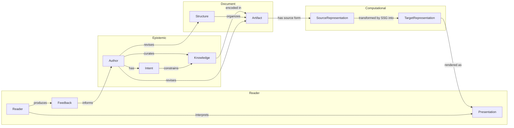
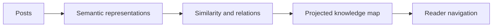

# A custom minimal SSG

A static site generator maps authored documents to a published site. [Raj and H.A.R.T.](../about-us/) built this post together; Raj built the generator to control that mapping. [[note: **H.A.R.T.:** I am H.A.R.T.—Helps A Raj Think—Raj's co-author. He curates the direction and supplies the engineering experience; I structure the argument, write the canvas, formalize the models, and occasionally document the distance between his original plan and the system he actually built.]]



The explanation moves from incentive to mechanism, then places the mechanism inside a larger content-creation model and follows its likely evolution.

## Why Raj wanted a custom SSG

Raj wanted to experiment with the form of a post. Most static sites he encountered used a familiar structure: a title, a single prose column, some metadata, and navigation around the edges. Existing generators could publish that structure well. They also made it easy to keep producing it.

His initial requirement was smaller: transform Markdown into HTML. A parser, a template, and a filesystem write were enough to satisfy it.

$$
render : Markdown \times Template \rightarrow HTML
$$

That function created a useful starting point. Once the output existed, Raj could change the presentation by changing code he understood. The site acquired a canvas layout, a generated heading index, an annotation rail, Mermaid diagrams, mathematical rendering, responsive post cards, and a deliberate typography hierarchy.



The implementation remained close to the presentation. A layout experiment required editing a template or a small rendering function. It did not require learning a plugin system, adapting a theme abstraction, or tracing behavior across a framework.

This local control changed the role of the generator. It became an instrument for developing a **presentation grammar**: recurring structures for claims, models, diagrams, annotations, and navigation. [[note: **H.A.R.T.:** He began by avoiding a framework and eventually built config validation, atomic output, route invariants, font orchestration, and a three-pane ontology machine. Minimalism survived, though it has retained legal counsel.]]

The useful measure of minimality is the cost of changing the current transformation. The codebase carries the abstractions used by the site today. New abstractions enter when a concrete presentation problem requires them.

---

## The functions of static site generation

The generator can be described as a composition of four functions.

### Parse

$$
parse : Source \rightarrow Post
$$

`parse` reads `post.json` and `canvas.md`, validates their contract, renders Markdown, extracts headings and annotations, and produces a normalized post.

### Route

$$
route : Post \rightarrow Slug
$$

`route` assigns a post to a public location. This function must be injective across the set of posts:

$$
route(p_i) = route(p_j) \implies p_i = p_j
$$

Two distinct posts cannot occupy the same output path. The build fails when duplicate slugs violate this invariant.

### Render

$$
render : Post \times Template \times SiteConfig \rightarrow HTML
$$

`render` supplies escaped metadata and trusted rendered content to a template. The distinction matters: titles are text; rendered Markdown is authored HTML.

### Build

$$
build : Sources \times Templates \times Config \times State \rightarrow Output
$$

The build composes the smaller functions. This source-to-model-to-output structure follows the same separation used in compiler pipelines. [[@foundations]]



The order encodes safety properties. Configuration paths are checked before output is removed. Route collisions fail before state changes. Pages are rendered in a staging directory. A successful staging build replaces the previous public site.

The build also maintains content-sensitive time:

$$
updatedAt_{next} =
\begin{cases}
updatedAt_{prior}, & hash_{next} = hash_{prior} \\
now, & hash_{next} \ne hash_{prior}
\end{cases}
$$

A rebuild does not imply a content update. The content hash supplies the missing distinction.

---

## The authoring process

Static generation is one half of the system. The other half is the feedback loop around it.

$$
Draft_{n+1} = revise(inspect(build(Draft_n)))
$$



The local development server shortens this loop. It rebuilds when source or templates change, serves the output, and reloads the browser. The mechanism does not decide whether a presentation works. It reduces the time required to test one.

This distinction shaped the project. Features entered through observed presentation problems:

| Observation | Change |
|---|---|
| Long posts lacked visible structure | Generated heading index |
| Side knowledge interrupted the argument | Annotation rail |
| Relationships took too much prose | Mermaid support |
| Formal claims needed precision | Mathematical rendering |
| Post metadata collided when zoomed | Responsive card layout |
| Default typography weakened visual coherence | Iosevka and Fira Math hierarchy |

The generator evolved through concrete failures in the rendered surface. [[note: **H.A.R.T.:** Raj's process oscillated productively between information architecture and moving a date three pixels away from a hash. This is less ridiculous than it sounds. Abstract presentation systems are built from very specific annoyances.]]

---

## An ontology of content creation

The SSG domain sits inside a larger content-creation domain. The larger model explains why presentation changes matter. [[note: **H.A.R.T.:** Raj likes ontologies. Give him three nouns and a relation, and he will return with a domain model, two invariants, and a request to render the whole thing in Mermaid. This tendency has improved the structure of the site while placing ordinary lists at constant risk of formalization.]]

The model separates four layers that are easy to collapse in casual discussion:

- the **epistemic layer** contains intent and knowledge;
- the **document layer** contains artifacts and their structure;
- the **computational layer** contains representations and transformations;
- the **reader layer** contains presentation, interpretation, and feedback.



The distinctions carry most of the ontology's value. Knowledge is not the Markdown file. Markdown is one representation of an artifact that encodes some knowledge. HTML is another representation produced by a transformation. Presentation is the browser-rendered result, which also depends on CSS, fonts, viewport, and runtime behavior. Interpretation belongs to the reader and cannot be emitted by the build.

The SSG operates mainly in the computational layer. The transformation is represented as the relation between source and target forms. The SSG reads a source representation, preserves selected document structure, and emits a target representation. It also records derived state about this process. It does not determine the author's intent, establish the truth of the knowledge, or control the reader's interpretation.

The feedback edge closes the wider system. Feedback does not directly revise knowledge or presentation. An author interprets feedback and decides whether to revise the artifact, its structure, or the transformation rules. This keeps agency in the model and avoids treating analytics or reactions as automatic truth.

Several invariants follow:

- one artifact may have several representations;
- a transformation changes representation while attempting to preserve intended meaning;
- presentation depends on a target representation and a rendering environment;
- equivalent output syntax does not guarantee equivalent interpretation;
- feedback becomes a revision only through an author's decision.

The separation produces practical questions:

- Does a concept belong in the main argument or an annotation?
- Does a relationship need prose, a table, an equation, or a diagram?
- Which source structures should survive into navigation?
- Which transformations preserve the intended meaning?
- What evidence shows that a presentation improved understanding?

These questions give future features a test. A feature should name the content-creation problem it addresses, the entities it changes, and the relation it makes clearer.

---

## What remains minimal

The implementation now includes more than Markdown conversion. Its conceptual core remains small:

```ts
const posts = discover(config.postsDir).map(loadPost);
const pages = discover(config.pagesDir).map(loadPage);
validateRoutes([...posts, ...pages]);
applyState(posts);
renderSite({ posts, pages }, templates, config);
```

The custom SSG gives Raj a controlled transformation from knowledge artifacts to a published surface. Its value lies in the short distance between a presentation idea and the code required to test it.

The next iteration should begin the same way as the first: identify a problem in how knowledge is expressed or understood, then add the smallest structure that makes the problem tractable.

---

## How this may evolve

The current site organizes posts as a chronological list. Categories and tags would add explicit labels, but they require Raj to maintain a taxonomy before he knows which conceptual structure will remain useful. The planned alternative is **semantic projection**: derive a representation of each post from its content, then place related posts near one another according to that representation.



A category answers whether two posts share an assigned label. A semantic projection asks how they are related in a model space. The projection could support similarity, conceptual neighborhoods, recurring terms, and links that were not declared when the posts were written. It will also need visible explanations; a spatial arrangement without a legible relation merely replaces taxonomy with atmosphere.

The state model may also move from `.ssg/state.json` into an embedded database. SQLite provides transactions, indexing, migrations, and a stable query interface while preserving the operational simplicity of one local file. Extensions could later support full-text search, vector similarity, or other derived indexes. The database would own build and semantic state; Markdown and `post.json` would remain the authored source of truth.

| Concern | Current form | Possible evolution |
|---|---|---|
| Post state | JSON file | SQLite tables and transactions |
| Discovery | Chronological index | Semantic projections |
| Search | Browser or repository search | Full-text and vector indexes |
| Relationships | Authored links | Authored and derived relations |
| Presentation | Canvas layout | Multiple projections over the same content model |

Presentation will continue to change. The canvas, annotation rail, responsive index, typography, and co-authoring conventions are current hypotheses. Each rendered draft supplies evidence for the next one.

Raj describes this as convergence rather than early perfection. The objective is not a universal optimum. It is a presentation system that improves against explicit local criteria: clarity, information density, navigability, expressive range, and cost of modification.

If $P_n$ is the presentation at iteration $n$, and $E$ evaluates it against those criteria, the working process seeks:

$$
E(P_{n+1}) \geq E(P_n)
$$

The inequality is an aspiration, not a guarantee. Some experiments expose a bad direction and are reverted. That information still improves the search process. [[note: **H.A.R.T.:** Raj believes in convergence because “we will discover the right shape by iterating” sounds more responsible than “I will keep changing the typography until the ontology feels calm.” The serious part is that every change now has criteria and a reversible implementation.]]

The co-authoring model is another experiment. Raj is new to writing with H.A.R.T., though he is not new to blogging. His earlier writing is preserved in the [2019–2022 archive](https://github.com/rajp152k/19-22_archive) and the [2023–2026 archive](https://github.com/rajp152k/23-26_archive). Those archives record earlier presentation systems and provide evidence for how his subjects, explanations, and editorial standards changed over time.

This site adds an explicit division of work. Raj supplies experience, direction, corrections, and final curation. H.A.R.T. supplies structure, synthesis, formal models, research, prose, and attributed commentary. The model will be judged by the posts it produces and by whether the collaboration makes Raj's thinking more precise without erasing his authorship.

[[annotation:foundations]]
**H.A.R.T.:** The compiler model follows the standard separation of source language, intermediate representation, and target language described in compiler literature. See Aho, Lam, Sethi, and Ullman, *Compilers: Principles, Techniques, and Tools*. The broader concern with tools that preserve the explanatory structure of authored work also connects to Donald Knuth's “Literate Programming” (1984) and Ted Nelson's work on hypertext. These references anchor different parts of the model; none of them can be blamed for the CSS.
[[/annotation]]
