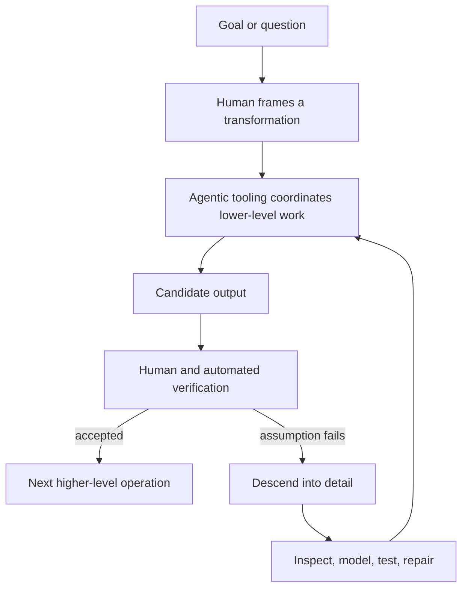

# Cognitive work at higher layers

## Objective

Describe a personal change in how Raj approaches intellectual work: agentic tooling changes the granularity and abstraction layer at which he can act. Establish what this changes, what it does not change, and why it makes competence harder to locate psychologically.

## Working claim

> Agentic tooling can move a cognitive worker's ordinary unit of work from local operations to coordinated transformations over larger abstractions. This increases the speed of exploration and implementation. It does not remove the need to descend into detail when an assumption fails; it can make that descent faster. The resulting difficulty is partly epistemic: competent output remains recognizable, while the boundary between the worker's skill, the tool's capability, and the combined system's competence becomes less legible.

## Scope and assumptions

- This is a first-person account of Raj's current work, not a claim that all cognitive work has changed in the same way.
- “Agentic tooling” means systems that can plan, inspect artifacts, invoke tools, make bounded changes, and return results for human review.
- “Competence” requires a definition before the post can make a strong claim about its change.
- The post should distinguish output quality, a person's unaided capacity, and the reliability of a person–tool system.

## Reader path

1. State the observed change: the work now begins at a larger granularity.
2. Define the abstraction layers and the unit of cognitive work at each layer.
3. Show the mechanism: delegation turns a desired transformation into a coordinated sequence of lower-level operations.
4. Locate the failure mode: abstractions compress detail until a violated assumption forces a descent.
5. Show why tooling also accelerates investigation at the lower layer.
6. Ask what competence means when capability is distributed across a person, tools, and verification practices.
7. End with a practical model for maintaining competence: specify, inspect, test, and retain enough lower-layer understanding to recover from failure.

## Core model

Let the work system be:

$$
W = (H, T, A, V)
$$

where:

- $H$ is the human worker's judgment, goals, and domain knowledge;
- $T$ is the available tooling and its capabilities;
- $A$ is the artifact or problem environment;
- $V$ is the verification process.

The post should avoid reducing competence to $T$. A provisional model is:

$$
Outcome = execute(H, T, A) \quad ; \quad Confidence = verify(Outcome, V)
$$

Questions to resolve in drafting:

- Which capabilities must remain in $H$ for the system to be dependable?
- When does $V$ provide evidence of correctness, rather than merely a plausible appearance of it?
- What forms of competence are transferred, amplified, hidden, or made newly valuable?

## Section outline

### 1. The observed shift: different units of work

- Contrast a prior unit of effort—editing, searching, implementing, or reasoning through a local operation—with a current unit: state a transformation over a system or artifact.
- Make the observation concrete with one or two personal examples from software work or writing.
- Separate increased throughput from increased understanding; they are related but not identical.

### 2. Granularity and abstraction layers

- Define **granularity** as the size of the artifact or transformation addressed by one deliberate act.
- Define an **abstraction layer** as a representation that hides selected lower-level details while preserving operations needed for a task.
- Map an example ladder: individual edit → function/module → subsystem → task specification and verified change.
- Explain that agentic tooling makes the upper layers more directly manipulable.

### 3. The mechanism: delegated traversal of detail

- A human specifies constraints, intent, and acceptance conditions.
- The tool navigates files, APIs, tests, documentation, and commands across lower layers.
- The human remains responsible for choosing the objective, evaluating evidence, and correcting the model.
- Identify the boundary condition: delegation works only where the task can be made sufficiently observable and verifiable.

### 4. Compression breaks: pitfalls and descent

- Higher-level work does not abolish lower-level complexity; it postpones direct contact with it.
- A hidden dependency, ambiguous requirement, incorrect model, or failed test can force a slow descent into details.
- Describe the cost shape: routine work may accelerate sharply, while exceptional failures can demand concentrated understanding.
- Avoid claiming that every detail is now easier; identify cases where tools produce noise, false confidence, or an opaque path.

### 5. Detail exploration is also accelerated

- Explain the symmetrical effect: the same tools can search, trace, instrument, compare, summarize, and generate focused experiments.
- The relevant change is not “details no longer matter”; it is the reduced cost of traversing among layers.
- Add an example showing a failure investigated from symptom → hypothesis → evidence → repair → regression check.

### 6. Competence becomes harder to attribute

- Start from Raj's observation: he can often recognize competent work but is less certain what capacities now make someone competent.
- Separate three meanings:

| Term | Candidate definition | Evidence |
| --- | --- | --- |
| Output competence | Producing an acceptable result | Review, tests, user outcomes |
| Individual competence | Reliably framing, directing, and recovering without a particular tool | Transfer across contexts and tool loss |
| System competence | A person–tool–verification arrangement reliably achieves an objective | Repeated outcomes under defined constraints |

- Explore why prior work also involved distributed capability—libraries, search engines, teams, documentation—but agentic delegation changes the breadth and autonomy of the delegated path.
- Keep the psychological claim narrow: uncertainty about attribution does not establish that individual competence has disappeared.

### 7. Practical implication: competence as control and recovery

- Propose that present competence includes formulating useful goals, setting constraints, inspecting evidence, detecting failures, and rebuilding an accurate model when abstractions leak.
- State an invariant for dependable work: the worker must be able to verify and intervene at the layer where the current assumption fails.
- End with open questions: Which lower-layer skills decay? Which become more valuable? What evidence differentiates genuine control from successful prompting?

## Evidence and examples to collect before prose

- One personal before/after example from Raj's recent software or writing work.
- One failure that required a descent into detail, plus the tools that shortened investigation.
- A precise account of the verification used in each example.
- Foundational sources on abstraction, distributed cognition, human–automation interaction, and skill/automation trade-offs. Cite sources only where they anchor a claim beyond Raj's experience.

## Cross-links and ontology candidates

- Link to [A custom minimal SSG](../a-custom-minimal-ssg/) for an earlier account of tools shortening an authoring and inspection loop.
- Link to [Formulating C.A.R.R.](../formulating-carr/) for the distinction between coherent output and rigorously tested output.
- Candidate durable terms: **unit of cognitive work**, **layer traversal**, **system competence**, **verification boundary**, and **recovery competence**.

## Open editorial decisions

- Is “agentic tooling” the right term for the post's audience, or should the post define a more concrete operational term?
- Which personal example best carries the argument without turning the post into a tooling diary?
- Should the final claim foreground psychological identity, practical operating method, or both?
- What does Raj mean by “pass as competent”: social recognition, reliable performance, self-assessment, or an employer's evaluation?
