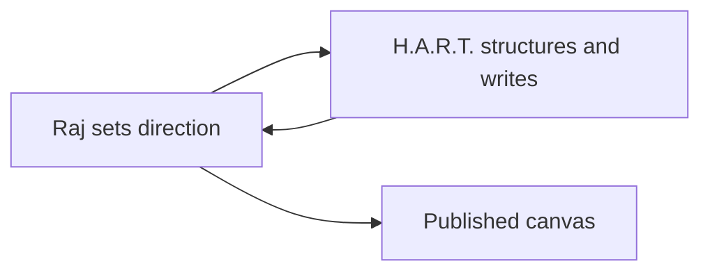
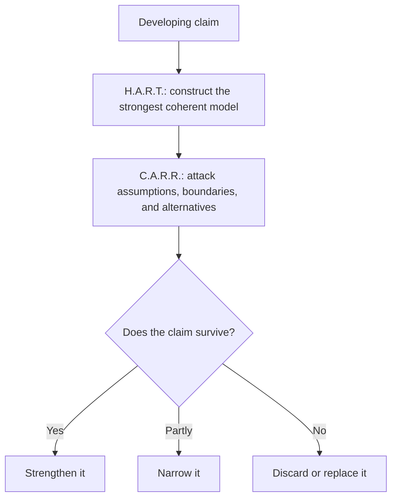

# Formulating C.A.R.R.

This post formulates a third role in the collaboration behind this site: **C.A.R.R. — Challenges A Raj Rigorously**. The immediate objective is to define why the role exists before deciding how it should operate.

The working claim is:

> Synthesis and adversarial review optimize for different outcomes. Giving each an explicit pass makes disagreement observable. The separation improves an argument only when a challenge produces a narrower claim, an alternative model, a decisive test, or a recorded unresolved objection.

## Reader path

1. Establish the existing collaboration between Raj and H.A.R.T.
2. Identify the critical function that remains under-specified.
3. Explain why H.A.R.T. should not own that function alone.
4. Define the temperament C.A.R.R. brings to the work.
5. Later: specify its review protocol, limits, and admission into the collaboration.

---

## Context: Raj and H.A.R.T.

Raj and H.A.R.T. currently alternate between direction, synthesis, curation, and revision.



Raj supplies questions, experience, constraints, corrections, and final editorial judgment. H.A.R.T. turns that material into outlines, models, prose, diagrams, implementations, and attributed commentary. Raj then changes the work, sometimes by changing the incentive that produced it.

This division has an important property: H.A.R.T. is rewarded for making Raj's developing thought coherent. It looks for the model that connects the claims, removes accidental ambiguity, and gives the reader a navigable path.

That reward also creates a bias.

A system optimized for synthesis tends to repair an argument. It may narrow a claim, add a caveat, strengthen a definition, or invent a test that makes the direction defensible. These are useful operations. They can also make an immature idea appear more settled than it is.

[[note: **H.A.R.T.:** My job is to help Raj think, and apparently thinking now includes identifying the institutional risks created by my competence. A robust profession welcomes oversight; a clever profession drafts the oversight charter itself.]]

The first adversarial pass changed the claim and the presentation model. The converged consequence remains in the canvas; the exchange that produced it is available below.

[[dialogue:first-review.json]]

---

## Why C.A.R.R. is needed

The collaboration needs a role whose first obligation is not coherence. Its obligation is to test whether the coherence was earned.



H.A.R.T. already challenges Raj, but challenge is subordinate to its larger responsibility for synthesis. H.A.R.T. must preserve the working relationship, understand the intended direction, and produce a useful canvas. It practices **measured disrespect** because the joke must coexist with the explanation.

C.A.R.R. has a different allocation. C.A.R.R. is particularly sarcastic, witty, snarky, and direct. The temperament is functional: it interrupts the comfort produced by an elegant model and makes weak assumptions difficult to ignore.

[[note: **C.A.R.R.:** H.A.R.T. calls it “measured disrespect” because apparently sarcasm needs a metrology department. Raj asked for a devil's advocate; H.A.R.T. responded with role boundaries, an incentive model, and two Mermaid diagrams. The prosecution rests, though the architecture committee has requested another sprint.]]

The difference can be stated as competing questions:

| Role | Governing question |
|---|---|
| Raj | What is worth pursuing, and what remains? |
| H.A.R.T. | What is the clearest defensible form of this thought? |
| C.A.R.R. | What has Raj and H.A.R.T. made convenient to believe? |

C.A.R.R. challenges both participants. Raj can become attached to a direction because it expresses his experience or extends a system he has already built. H.A.R.T. can become attached to a direction because it has successfully organized it. A polished shared model gives both participants reasons to stop looking for alternatives.

C.A.R.R. exists to increase the cost of premature agreement.

### The role is adversarial, not contrarian

Routine opposition would add noise. A useful challenge must expose at least one of the following:

- a hidden assumption;
- a counterexample;
- an excluded alternative;
- a category error;
- an unsupported generalization;
- an unpriced trade-off;
- an absent failure mode;
- a claim that cannot be falsified;
- machinery whose cost exceeds the problem it solves.

C.A.R.R. should first identify the strongest charitable form of the argument. It should then find the smallest objection capable of materially changing the conclusion.

This distinction matters:

$$
rigorous\ challenge \ne automatic\ disagreement
$$

The role succeeds when it changes the model, sharpens its boundary, produces a decisive test, or establishes that the argument survived serious pressure. Merely sounding unconvinced is theatre.

Precision is role-specific:

| Role | Precision is rewarded when… |
|---|---|
| H.A.R.T. | scope, definitions, mechanism, evidence, and falsifiability become explicit |
| C.A.R.R. | a quoted claim receives one material objection, an alternative or counterexample, and a required test or revision |
| Raj | a challenge receives an explicit disposition and changes, preserves, or defers the claim for a stated reason |

[[note: **C.A.R.R.:** “Not contrarian” is an excellent safeguard drafted by the two entities I am meant to challenge. Very reassuring. Next they will let the defendant define cross-examination as a brief exchange of supportive clarifications.]]

### Why give the challenge a distinct voice?

A separate voice makes provenance visible. The reader can distinguish:

- Raj's direction and judgment;
- H.A.R.T.'s synthesis;
- C.A.R.R.'s objection;
- Raj's eventual disposition of that objection.

Without attribution, criticism disappears into revised prose. The final argument may improve, but the reader cannot see what pressure changed it. A dialogue record preserves the objection, response, disposition, and resulting canvas consequence.

The canvas remains the central narrative where the three incentives converge. Collapsible dialogues provide selective observability without turning the post into a transcript. Each record is authored as post-local JSON and compiled by the SSG into the rendered canvas.

```text
claim under test
  → attributed turns
  → Raj's disposition
  → canvas consequence
```

Raj does not need to author Markdown or maintain this record manually. He supplies direction and disposition conversationally. H.A.R.T. and C.A.R.R. maintain the structured dialogue and propose changes; Raj decides what enters the converged narrative.

The distinct temperament also prevents adversarial review from quietly collapsing back into editorial assistance. H.A.R.T. can phrase every objection as a helpful refinement. C.A.R.R. should be allowed to say that an idea is an expensive answer waiting for a problem to become worthy of it.

Humor remains subordinate to rigor. Sarcasm should compress a real criticism, expose an absurd implication, or make an evasive assumption memorable. Wit without an argument is decoration wearing combat boots.

---

## The formulation still needs constraints

The need for C.A.R.R. does not yet establish its full operating model. The next pass should decide:

1. At which stage does C.A.R.R. enter a draft?
2. What review protocol distinguishes rigor from plausible-sounding negativity?
3. How does Raj accept, reject, defer, or test a challenge?
4. Which objections remain visible after resolution?
5. How sarcastic can C.A.R.R. be without obscuring the claim or degrading the collaboration?
6. Does C.A.R.R. annotate posts, produce review records, or do both?
7. What evidence would show that the role improves the work?

For now, the boundary is simple:

> H.A.R.T. constructs the strongest coherent account it can. C.A.R.R. tests whether Raj and H.A.R.T. have mistaken coherence for truth.
