# Writing a minimal SSG

A static site generator is a small compiler for a website.

The source language is Markdown plus JSON. The target is HTML in `public`. The useful work is the transformation between them.

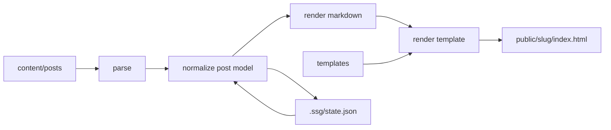

The design constraint is restraint. The pipeline should stay easy to inspect and easy to change.

## Incentive

The goal was to rethink how information should be presented when unnecessary distractions are removed.

$$
presentation = f(content, structure, constraints)
$$

where:

- `content` is the authored knowledge;
- `structure` is the outline, panes, annotations, diagrams, and templates;
- `constraints` remove distractions and keep the essential parts visible.

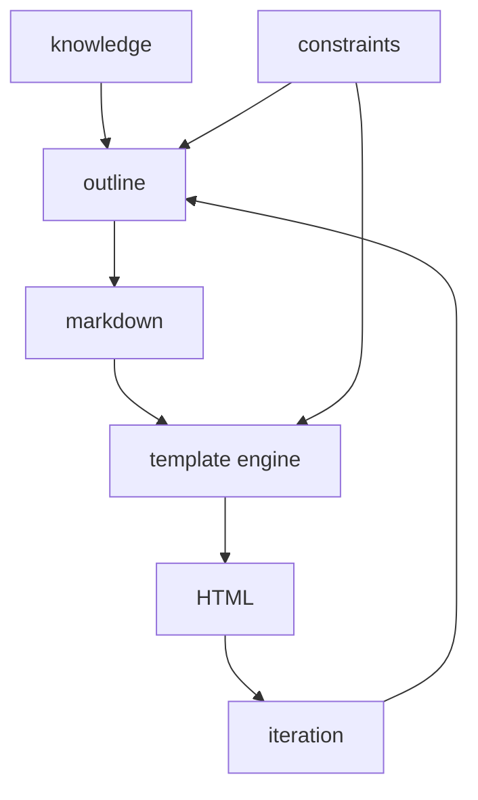

An existing static site generator would have solved publishing while importing its own defaults. This codebase stays small so the presentation system can change as the writing style evolves. [[note: This is an engineering constraint. A smaller local system reduces the cost of changing posts, panes, annotations, and templates.]]

The mental model is metaprogramming: write source documents in Markdown, add structure through JSON and templates, then pass them through an engine that emits final HTML. [[note: In compiler terms, Markdown and `post.json` form the source language; the normalized `Post` object is an intermediate representation; HTML is the target language.]]

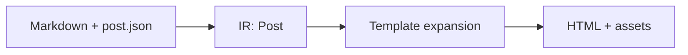

This makes the SSG a tool for converging on a personal presentation grammar.

## The minimal contract

The generator in [`rajp152k/ssg`](https://github.com/rajp152k/ssg) needs four things:

1. a content directory: `content/posts`
2. templates: `templates/index.html` and `templates/post.html`
3. config: `ssg.config.json`
4. commands: `build`, `dev`, and `new`

That is enough to turn authored files into a navigable site.

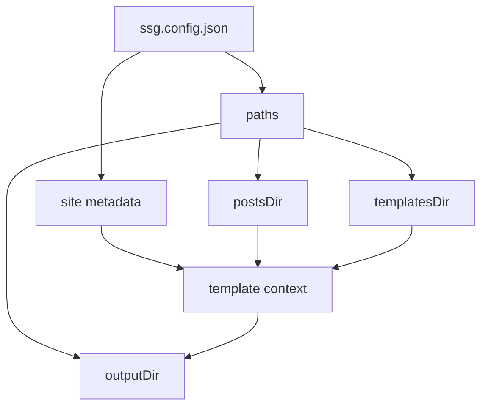

The config layer resolves paths, fills site metadata, and gives templates values like `{{site_title}}`, `{{author}}`, and `{{css_import}}`.

## Posts: two inputs, one model

The useful simplification is normalizing different post shapes into one `Post` object.

[`rajp152k/ssg`](https://github.com/rajp152k/ssg) supports single Markdown posts and directory posts.

```txt
content/posts/welcome.md
content/posts/my-topic/post.json
content/posts/my-topic/canvas.md
```

The build should not care which input shape was used. It should ask for sources and receive normalized posts.

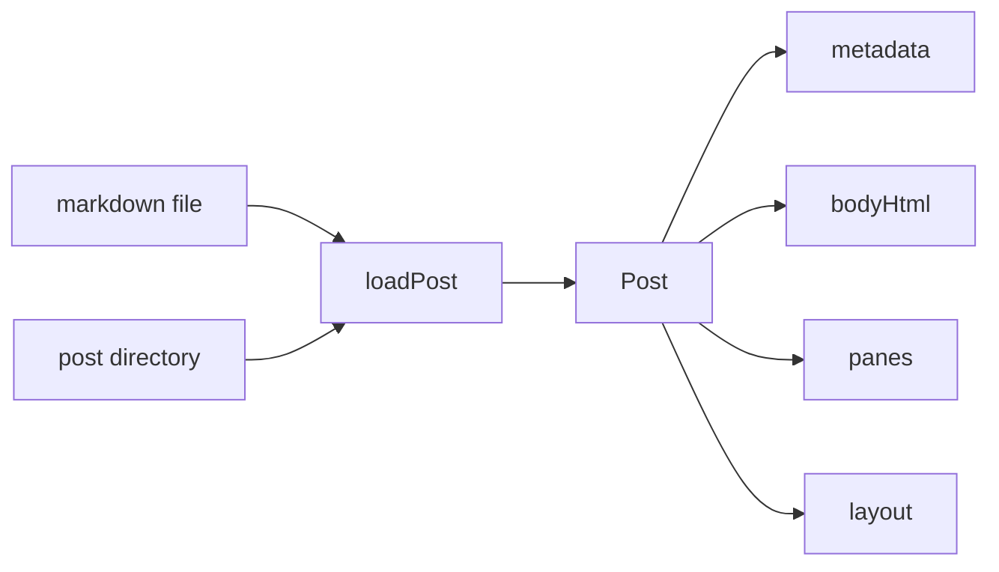

$$
loadPost : Source \rightarrow Post
$$

The build becomes a map over sources:

$$
posts = sources.map(loadPost)
$$

That small equation is the architecture.

## Slugs and routes

Each post becomes one route:

$$
route(post) = /slug(post)/index.html
$$

The slug comes from explicit metadata when available, then from the title or filename.

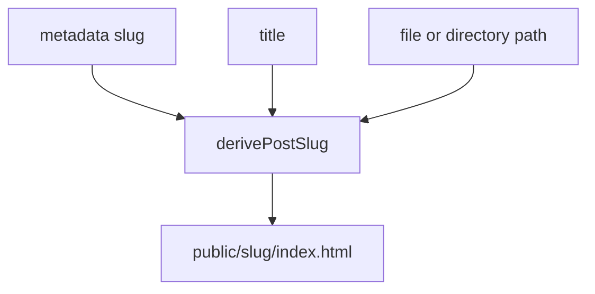

A minimal SSG should be deterministic. The same inputs and config should produce the same routes.

## Markdown is not the whole post

Markdown becomes HTML through `marked`, but the post model adds structure around it:

- metadata;
- panes;
- layout;
- heading indexes;
- annotations;
- Mermaid diagrams;
- MathJax equations.

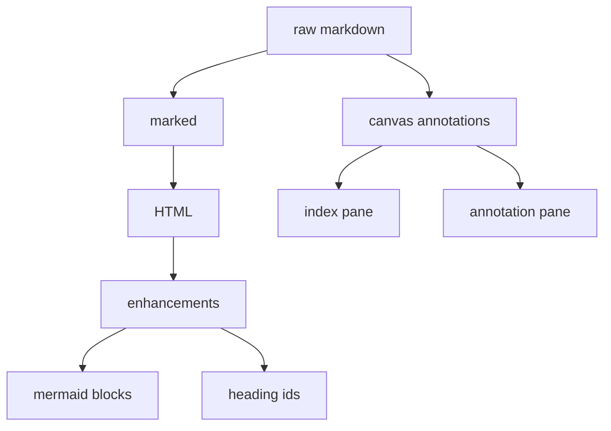

Markdown is the prose layer. `post.json` carries document structure.

## Canvas posts

A canvas post is a three-pane document.

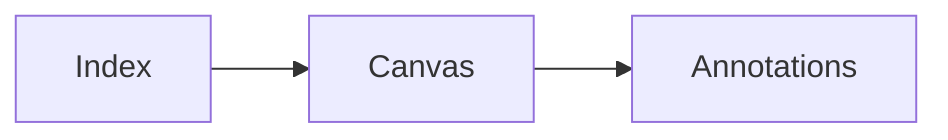

The left pane is generated from headings. The middle pane is authored. The right pane is generated from inline notes and annotation blocks.

This is minimal because generated panes are derived from one source pane. There is no separate database or editor state.

## State: created, updated, hash

A static site still needs memory. [`rajp152k/ssg`](https://github.com/rajp152k/ssg) stores that memory in `.ssg/state.json`.

For each post it tracks:

- `createdAt`
- `updatedAt`
- `contentHash`

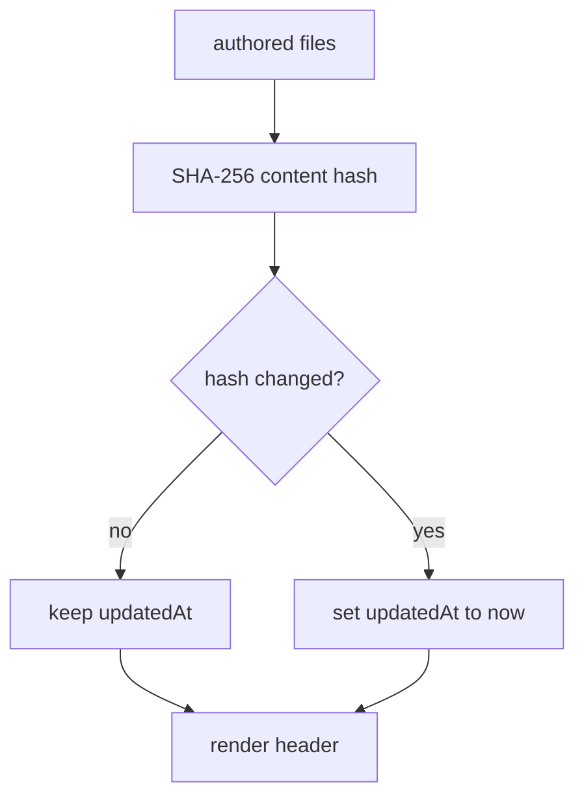

$$
updatedAt_{next} =
\begin{cases}
updatedAt_{prior}, & hash_{prior} = hash_{next} \\
now, & hash_{prior} \ne hash_{next}
\end{cases}
$$

This makes timestamps content-sensitive instead of build-sensitive.

## Templates are replacement maps

The template system uses strings with placeholders.

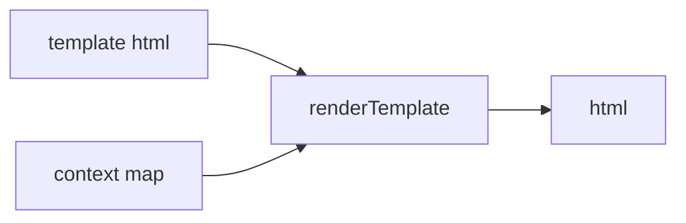

This is enough for variables, post lists, and workbench markup.

## Dev mode is build plus feedback

`dev` wraps `buildSite` with a file watcher, a small HTTP server, and live reload.

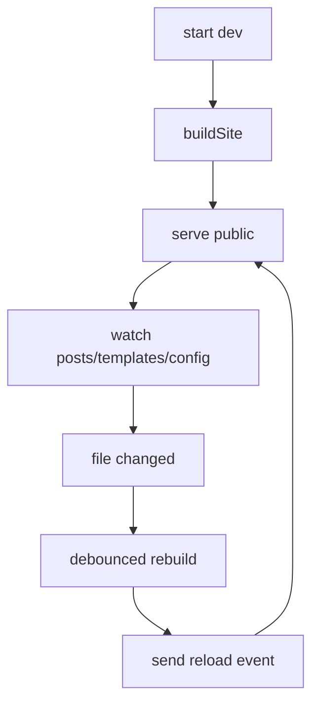

Dev mode keeps the same build path and adds iteration speed.

## What it actually is

The current system is a working minimal SSG with a few opinionated additions:

- Markdown posts and directory posts;
- canvas posts with generated index and annotations;
- Mermaid and MathJax support;
- template-driven HTML output;
- content-sensitive post state;
- a dev server with live reload.

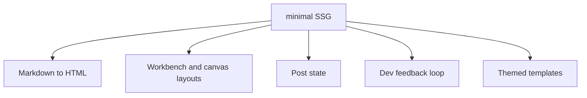

That is enough. The goal is to keep the current shape legible.

## The core loop

```ts
const config = resolveConfig(options);
const sources = collectPostSources(config.postsDir);
const posts = sources.map(loadPost);
applyPostState(posts, getStatePath(config.sourceDir));
renderPosts(posts, config);
renderIndex(posts, config);
```

A minimal SSG is minimal when each step has one job and the composition is easy to see.
