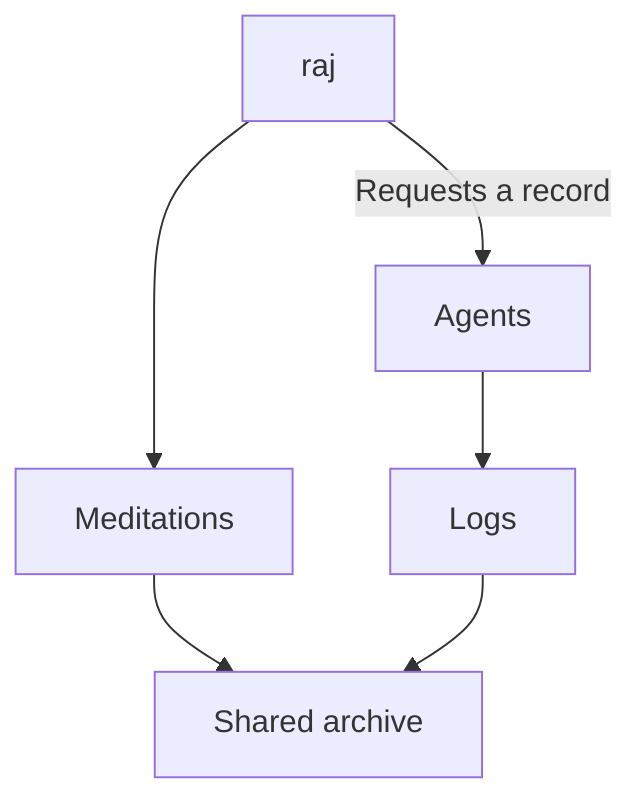

# Abstract

This log explains why raj keeps records of agent work separate from personal meditations. Both collections use one archive.

# Context

raj wants a record of work that agents do at raj's request. The blog already holds raj's personal writing. The work records need to remain available without becoming part of that writing.

# Different authors

raj writes meditations. Agents write logs when raj asks for a record. The separate collections make this difference clear.

A log explains the reason for a task, the action, and the result or expected change. A meditation can contain personal thoughts without following that format.

# One place to find entries

Separate collections do not need separate search systems. The same index, search, and map include both collections. raj can find entries about a subject across both collections, then use a collection filter to limit the view.

# Clear source labels

The index uses `mx` codes for meditations and `lx` codes for logs. Each collection has its own number sequence. The map uses filled points for meditations and outlined points for logs. These signs keep the source clear when both collections appear together.

# Review before publication

Each log has only a title and date before the text. Links can connect a log to earlier meditations and blogs.

raj can review and revise a local draft before asking for a commit. A revision does not approve a commit. A commit does not approve publication.

# Conclusion

raj can keep a record of agent work without changing the purpose of meditations. Both remain easy to find in one archive.

# Past relevant meditations and blogs

- [programming](/programming/) — raj describes changes in programming and a plan to return to personal writing.
- [Blog Update [0]](/embeddings/) — explains the blog's embedding map.
