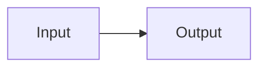

# Authoring syntax

This file records the blog-specific syntax supported by the static site generator. Update it whenever an authoring construct or its rendering contract changes.

## Post files

A post is a directory containing its metadata and canvas:

```text
content/posts/<slug>/
  post.json
  canvas.md
```

Post-local dialogue records may be added beside these files.

## Markdown

`canvas.md` supports standard Markdown, fenced code blocks, tables, and links.

Use display mathematics with `$$` on separate lines:

```markdown
$$
f(x) = x^2
$$
```

Do not use `\[` and `\]` delimiters.

## Mermaid

Use a fenced `mermaid` block:

````markdown

````

## Annotations

Annotations appear in the generated annotation pane only when the canvas contains a reference.

### Inline annotation

Use an inline note for a single reference:

```markdown
A claim that needs supporting context. [[note: **H.A.R.T.:** Supporting context.]]
```

### Reusable annotation

Place a reference where the annotation number should appear:

```markdown
A claim that needs supporting context. [[@foundations]]
```

Define the referenced body elsewhere in the same canvas:

```markdown
[[annotation:foundations]]
**H.A.R.T.:** Supporting context.
[[/annotation]]
```

The identifier may contain letters, numbers, underscores, and hyphens. Repeating `[[@foundations]]` reuses the same annotation and label.

A standalone `[[annotation:id]]` block without a matching `[[@id]]` reference is removed from the canvas and does not appear in the annotation pane.

## Dialogues

Embed a post-local dialogue record as its own paragraph:

```markdown
[[dialogue:review.json]]
```

The token must be on a standalone line with blank lines around it. An inline dialogue token remains literal text because the renderer replaces only a paragraph containing the token by itself.

The referenced JSON file must remain inside the post directory. Its supported shape is:

```json
{
  "title": "Dialogue title",
  "claim": "Optional claim under test",
  "turns": [
    {
      "speaker": "H.A.R.T.",
      "body": "Markdown-supported dialogue body."
    }
  ],
  "disposition": {
    "status": "narrowed",
    "by": "Raj",
    "body": "Result of the review."
  },
  "canvasConsequence": "How the converged canvas changed."
}
```

Supported disposition statuses are `accepted`, `narrowed`, `rejected`, `deferred`, `unresolved`, and `revised`.

## Verification

After changing publishable content or syntax usage, run:

```bash
npm run blog:build:local
```
